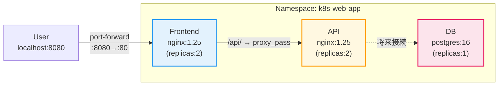

# k8s-web-app

Kubernetes 学習用の 3 層 Web アプリケーション（Frontend + API + DB）。
kind クラスタ上で動作する 11 個の YAML マニフェストで構成されています。

## 構成図



## 前提条件

| ツール | バージョン目安 |
|--------|--------------|
| kind | v0.20 以上 |
| kubectl | v1.27 以上 |

```bash
# kind クラスタが起動していること
kind get clusters
```

## クイックスタート

```bash
# 1. リポジトリをクローン
git clone https://github.com/shu130/kubernetes_kind.git
cd kubernetes_kind   # ← リポジトリ名のディレクトリが作られる

# 2. 全リソースを番号順に一括適用
kubectl apply -f .

# 3. Pod が Running になるまで待つ
kubectl get pods -n k8s-web-app --watch

# 4. port-forward でアクセス
kubectl port-forward svc/frontend-svc 8080:80 -n k8s-web-app
```

ブラウザで http://localhost:8080 を開くとトップページが表示されます。

## ファイル構成

```
k8s-web-app/
├── 01-namespace.yaml           # Namespace: k8s-web-app
├── 02-db-secret.yaml           # Secret: db-secret（DBパスワード）
├── 03-db-configmap.yaml        # ConfigMap: db-config（DB設定 + init.sql）
├── 04-api-configmap.yaml       # ConfigMap: api-config（nginx設定）
├── 05-frontend-configmap.yaml  # ConfigMap: frontend-config（nginx設定 + HTML）
├── 06-db-deployment.yaml       # Deployment: db (replicas: 1)
├── 07-db-service.yaml          # Service: db-svc (ClusterIP)
├── 08-api-deployment.yaml      # Deployment: api (replicas: 2)
├── 09-api-service.yaml         # Service: api-svc (ClusterIP)
├── 10-frontend-deployment.yaml # Deployment: frontend (replicas: 2)
└── 11-frontend-service.yaml    # Service: frontend-svc (NodePort:30080)
```

ファイル番号は依存関係順（Namespace → Secret → ConfigMap → DB → API → Frontend）です。

## 動作確認

```bash
# トップページ
curl http://localhost:8080
# → HTML が返る

# API ヘルスチェック
curl http://localhost:8080/api/health
# → {"status": "ok", "service": "api"}

# API ルート
curl http://localhost:8080/api/
# → {"message": "Welcome to the API"}

# リソース状態の確認
kubectl get all -n k8s-web-app
```

## 削除

```bash
# 全リソースを一括削除
kubectl delete -f .

# Namespace ごと削除する場合（上記と同等）
kubectl delete namespace k8s-web-app
```

## 関連

- Qiita 記事：[Kubernetes設計・構築メモ 第7回 総合演習](https://github.com/shu130/kubernetes_kind)
- 詳細仕様：[k8s-web-app-spec.md](../specs/k8s-web-app-spec.md)
